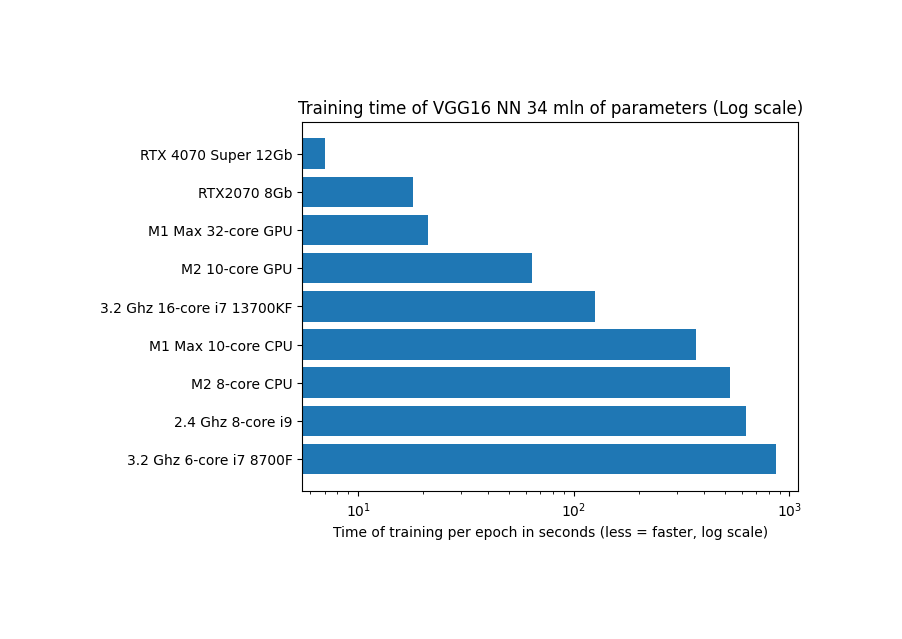

# Repo dedicated to various Tensorflow-metal experiments

## How to run on M1 chip with GPU support

Install conda (as possible option use https://github.com/conda-forge/miniforge/releases)
```
chmod +x ~/Downloads/Miniforge3-MacOSX-arm64.sh
sh ~/Downloads/Miniforge3-MacOSX-arm64.sh
```

Create conda environment (not for Windows):
```
source ~/miniforge3/bin/activate
conda create -n tensorflow python=3.9.13
conda activate tensorflow
```

Install dependencies (for M1/M2 chips)
```
conda install -c apple tensorflow-deps
python -m pip install tensorflow-macos
python -m pip install tensorflow-metal
brew install libjpeg
conda install -y matplotlib jupyterlab
```

Install dependencies (for x64 MacBooks)
```
conda install tensorflow
brew install libjpeg
conda install -y matplotlib jupyterlab
```

Install dependencies & create env (for Win GPU machine) 
```
conda create -n tf-gpu tensorflow-gpu
conda activate tf-gpu
conda install -y matplotlib jupyterlab
```

Test installation by running Jupyter lab
```
jupyter lab
```
Run `tf_fashion_mnist_train.ipynb` or `tf_mnist_train.ipynb`, check Activity monitor to check that GPU is utilised

Test results (comparison of different approaches):




```
+-----------------------------------------------------------------------+-----+-------------------------------+----------------------------------------+---------------------------------------------------------+
|                               Hardware                                | GPU | Avg train (MNIST, 93k params) | Avg train (MNIST Fashion, 412k params) |       Avg train (VGG16, CIFAR-100, 34mln params)        |
+-----------------------------------------------------------------------+-----+-------------------------------+----------------------------------------+---------------------------------------------------------+
| Apple M1 Max with 10-core CPU, 32-core GPU, 64 Gb RAM                 | Y   | 106 sec                       | 127 sec                                | 21s/epoch, 54ms/step (size=128)                         |
| Apple M1 Max with 10-core CPU, 32-core GPU, 64 Gb RAM CPU ONLY        | N   | 85 sec                        | 114 sec                                | 368s/epoch, 940ms/step (size=128)                       |                                  
| Apple M2 with 8-core CPU, 10-core GPU, 24 Gb RAM                      | Y   | 109 sec                       | N/A                                    | N/A                                                     |                                  
| Apple M2 with 8-core CPU, 10-core GPU, 24 Gb RAM CPU ONLY             | N   | 89 sec                        | N/A                                    | N/A                                                     |                                  
| 2.4 Ghz 8-core i9 32 Gb RAM                                           | N   | 254 sec                       | 423 sec                                | 630s/epoch, 2s/step (size=128)                          |
| Nvidia 8Gb GDDR6 RTX2070 Windows 10 Anaconda 32 Gb RAM                | Y   | 55 sec                        | 54 sec                                 | 18s/epoch, 43ms/step (size=128)                         |
| Intel(R) Core(TM) i7-8700 CPU @ 3.20GHz Windows 10 Anaconda 32 Gb RAM | N   | 136 sec                       | 255 sec                                | 863 sec epoch  2s/step (size=128)                       |
+-----------------------------------------------------------------------+-----+-------------------------------+----------------------------------------+---------------------------------------------------------+
```
